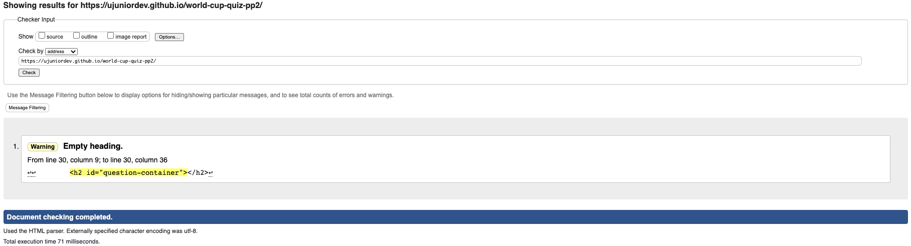
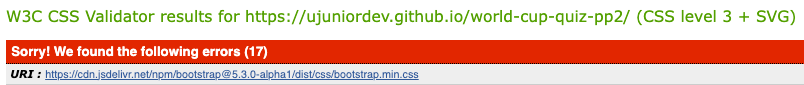
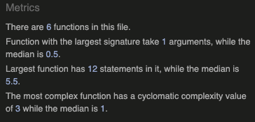
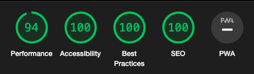

# World Cup Quiz
## Project Portfolio 2
Are you a football fan? Would you like to test your knowledge about the FIFA World Cup? If your answer is yes, try this quiz I have just made. The quiz contains a couple of questions about the World Cup editions and in the end, it will display your score.

## User experience

The main goal of the project was to have a clean page, with a fluid experience for the user.
The user stories that were used to develop the website are listed below:

 - **US 01 Header**
As a user, I want to have a website logo so that I understand what the website is for.
 - **US 02 Question counter**
As a user, I want to have a list of question numbers so that I understand how many questions the quiz has and follow my progress.
 - **US 03 Questions & answers**
As a user, I want to visualize the questions so that I am able to answer them.
As a user, I want to visualize the options so that I can choose the right answers.
 - **US 04 Start/Restart/Play again button**
As a user, I want to visualize a Start/Restart/Play again button so that I can start or restart the quiz.

### Features

This website contains the following features/pages that were developed considering the user's stories listed in the section User experience above, they should all have responsive behavior allowing navigation on any device:
 - **F01 Header (using US01)**
The header is composed of 1 main element: the logo in simple text and the main goal is to inform the user of the purpose of the page.
 - **F02 Question counter (using US02)**
The question counter lists the total number of questions in the quiz, with the goal of informing the user of his progress. The question counter also displays the correct and incorrect answers by using background color. No action happens when the user clicks on the question numbers.
 - **F03 Questions & answers (using US3)**
This block is straightforward and it brings to the user the questions about the World Cup and 4 options for each question.
 - **F04 Start/Restart/Play again button (using US4)**
When pressing the button Start/Restart/Play again the user is redirected to the beginning of the game and can play again.

### Features to be implemented

- Create a bigger poll of questions that can be always randomly displayed for the user
- Improve the end game scoring text to display CONGRATS or TOO BAD, depending on the final score of the user
- Make it possible for the user to share his score on social networks
- Allow the user to save his progress

## Design

The following design choices were made: clean and simple fonts & color palettes, but since the main goal of this page is to be playful, a background image was included with the World Cup cup & the use of Bootstrap was included to add colors to the buttons.

## Technologies

 - HTML5
 - CSS3
 - Vanilla JavaScript
 
## Frameworks, font and image libraries, Programs and code websites references used during the implementation

### Frameworks
 - [Git](https://git-scm.com/) was used for version control through [Gitpod](https://gitpod.io/) terminal, using CLI git commands to commit and push to GitHub
 - [GitHub](https://github.com/) is used as the repository for the entire project
 ### Libraries
 - [Google Fonts](https://fonts.google.com/) was used to add the Montserrat and Hind fonts into the CSS file and was used on all the pages
 - [Font Pair](https://www.fontpair.co/) and [Font Joy](https://fontjoy.com/) were used to find combinations of fonts to be used in the website
 - [Flat Icon](https://www.flaticon.com/) was used to add the skills images to the skills page
 - [Bootstrap] (https://getbootstrap.com/) was used to add a nice style specially to the buttons of the game
 ### Code
 - During the implementation of the website, it was made necessary to look for examples and of code and different ways to achieve the required goal. Therefore a couple of community websites were used, such as the [W3C Schools website](https://www.w3schools.com/) that was extensively used to check the syntax and code examples
 - [Developer Mozilla](https://developer.mozilla.org/) was used to help to understand the concept of using display flex orientation on the website
 - [Stack Overflow](https://stackoverflow.com/) was also referenced to check JavaScript function methods and iteration methods
 - And of course, the [Code Institute LMS](https://learn.codeinstitute.net/) was extensively used especially the JavaScript essentials module

 ## Testing

The testing plan was based on the features described for the website

**ID**|**Test Label**|**Steps**|**Expected Outcome**|**Result**|**Feature Checked**|
:-----:|:-----:|:-----:|:-----:|:-----:|:-----:|
| T01 | Plain text logo |Play a game round to check if the logo is present during all steps of the game  | Logo is present during the game | PASS | F01 |
| T02 | Questions counter | Start a game and go till the end to see if the counter will display the number of questions and if it will change colors depending on the answer | Counter will be displayed and change the colors during the game depending on the answers | PASS | F02 |
| T03 | Questions and Answers |Play a game to check if the questions and answers will be displayed accordingly | Questions will be displayed followed by 4 answer options displayed in a gray button | PASS | F03 |
| T04 | Start button | Open the website and click on start game | The game will start and the first question should be displayed | PASS | F04 |
| T05 | Restart button | Open the website, start a new game, reply a couple of questions and then click on restart game | The game should restart, the counter should reset and the first question should be loaded | PASS | F04|
| T06 | Play Again button | Play a game until the end and once the score is displayed click on play again | The game should restart, the counter should reset and the first question should be loaded | PASS | F04 |
| T07 | Responsiveness | All tests above should be carried out on different resolution screens to check whether the content is properly displayed | Content should be properly displayed and accommodated within different resolutions - Media queries were added to properly adjust the content where necessary, for example the questions container | FAIL | All features |
| T08 | Browser compatibility | Open the website on different browsers to check compatibility | The website should load without any issues | PASS | All features |

### Code Validation

 - To check the HTML of the website, I used the [W3C HTML checker](https://validator.w3.org/) 
 - The results can be seen below:
	 - Index page - Note that there is an error on the HTML pointing that the h2 tag is empty, but the reason is that this is populated with the question using JavaScript
    
 - To check the CSS of the website, I used the [W3C CSS3 Jigsaw validator](https://jigsaw.w3.org/css-validator/)
 - The result can be seen below:
     - Note that the error displayed is related to the Bootstrap cdn import which is not managed by the website but a framework which was imported to the website
    
 - To check the JavaScript of the website, I used the [JSHint, A Static Code Analysis Tool for JavaScript](https://jshint.com/)
 - The result can be seen below:    
    

### Website Responsiveness

To check the website´s responsiveness I carried out a Lighthouse test. The result can be seen below.
Note that the test was made in an Incognito mode browser tab so there were no interferences from browser extensions.

### Known Bugs

Console error when displaying the score, but could not identify the error on the code and everything is working fine.

## Deployment

The site is hosted within GitHub pages. To deploy it to the repository, the the steps below have to be followed:

- In the GitHub repository, navigate to the Settings tab
- From the source section drop-down menu, select the Master Branch
- Once the master branch has been selected, the page will be automatically refreshed with a detailed ribbon display to indicate the successful deployment.
- All modifications to the code that have been pushed to the master branch using Git Push will take effect on the live project

A link to the up and running project can be found here - [World Cup Quiz](https://ujuniordev.github.io/world-cup-quiz-pp2/)

## How to clone the repository
 - Browse to https://github.com/ujuniordev/ujunior-cv-pp1, which is the repository where the project is located on GitHub
 - Click on the "Code" button´s arrow to open the dropdown menu
 - Select the HTTPs tab and copy the link given there
 - Open “Git Bash” and change the current working directory to the location where you want the cloned directory to be stored
 - Type git clone in the terminal, paste the URL you copied earlier, and press “enter” to create your local clone
